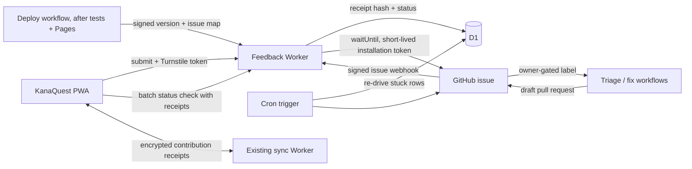

# Feedback-to-fix implementation plan

**Status:** proposal, researched 2026-08-24, reviewed and revised 2026-08-24
**Scope:** in-app feedback submission, GitHub issue creation, request tracking,
release-aware notifications, and a learner-facing contribution history

## Evaluation of this plan (review, 2026-08-24)

The plan below is sound and unusually careful about the parts that normally go
wrong — idempotency, capability receipts, "closed is not released," and keeping
the sync Worker's privacy promise intact. Those should not be watered down.

Three things were checked against the repository and needed correcting:

1. **There is no CI and no `.github/` directory at all.** Phase 4 assumed "a
   GitHub Pages release workflow" already exists to hook the release
   notification onto. It does not. Pages currently deploys straight from the
   `main` branch root (README, *Deploying to GitHub Pages*), so today a release
   *is* `git push` — no tests run, no artifact, nothing to attach a signed
   release call to. Release automation is therefore a prerequisite for the
   notification, not a step inside it. It is now its own phase.
2. **Tests are JavaScriptCore, not Node.** `test/*.js` use the `jsc` globals
   `load()`, `readFile()`, and `print()` (5, 4, and 21 call sites), and the
   README states there is no Node on the development machine. Any CI job has to
   either run on a `macos-latest` runner and reuse the same `jsc` binary, or
   ship a small shim. This constrains Phase 4 concretely and is easy to trip on.
3. **Part of the proposed version test already exists.** `test/wiring.js:265`
   already asserts `APP_VERSION` equals `sw.js`'s `VERSION`. Only the changelog
   leg of that three-way check is missing.

Two scope judgements:

- **Cloudflare Queues requires a paid Workers plan.** For a single-family PWA
  that is a real cost and an extra moving part, and the plan already establishes
  that the D1 row — not the queue message — is the source of truth. A cron
  sweep over D1 gives the same durability. The Queue is now the *Full track*,
  with a **Lean track** recommended first (see below).
- **The "no AI coding agent" non-goal conflicts with the stated goal of a
  maximally automated feedback-to-fix loop.** It has been re-scoped rather than
  dropped: an agent may draft, but only a maintainer action can start it, and
  only a maintainer merge can ship it. See *Automating the path from feedback to
  fix*.

One thing the plan under-specifies given the emphasis on recognition: the
learner is "remembered" only by their encrypted profile holding the receipt
tokens. That is the right design — no account, no email — but it means the
contribution history and the thank-you are as durable as the profile is. Sync
and backup export already carry it; that dependency should be stated in the UI
copy ("your contributions live in this learner's profile"), not discovered.

**The repository is public** (`github.com/natembriggs/kana-quest`), and README
notes Pages from a private repo needs a paid plan. So the public-issue warning
path is the live one unless a separate private inbox repository is created —
which is free and is still the recommendation for a child-facing app.

## Recommendation and difficulty

The button itself is easy. A form can call a Worker, and the Worker can create a
GitHub issue with one API request. The surrounding product is a **medium-sized
feature** because a public submission endpoint needs abuse protection, GitHub
credentials must never reach the browser, issue state has to be translated into
friendly in-app state, and "fixed" must be distinguished from "actually present
in the version this learner has loaded."

### Two tracks

Build the **Lean track** first. It delivers the entire product the request
describes — submit, track, get remembered, get thanked in the version that fixed
your report — on Cloudflare's free tier, with one fewer distributed system to
reason about. The Full track's extras are operational hardening that only starts
to pay off at a volume this app will not see for a long time.

| | Lean track (recommended) | Full track (add later if needed) |
| --- | --- | --- |
| Issue creation | Inline in the request via `ctx.waitUntil()` | Cloudflare Queue + consumer |
| Retry of failures | Cron trigger sweeping stuck D1 rows every 5 min | Queue retry + dead-letter queue |
| Plan required | Workers free tier | Paid Workers plan (Queues) |
| Staging | `wrangler.toml` `[env.staging]`, same D1 with a prefix or a second free D1 | Fully separate Worker, D1, Queue, widget, GitHub App installation |
| Everything else | Identical | Identical |

Nothing security-relevant is cut. Turnstile, the capability receipts, the
webhook HMAC, the release HMAC, the input allowlist, and the rate limits are all
in the Lean track — they are what actually stands between a public endpoint and
abuse. What is cut is the queue, which was never the durable record: the plan
already makes the D1 row the source of truth, and a cron sweep recovers exactly
the same failure windows the Queue consumer was recovering.

Rough one-developer estimates:

| Result | Lean | Full | What it includes |
| --- | ---: | ---: | --- |
| Safe feedback-to-GitHub MVP | 1.5–2.5 days | 2–4 days | Form, separate Worker, Turnstile, D1 receipt, GitHub issue creation, cron sweep, basic tests |
| Tracked feedback loop | +3–5 days | +4–7 days | Synced receipt history, GitHub webhooks, status screen, release mapping |
| Release automation | +1–2 days | +1–2 days | CI on `macos-latest`, Pages via Actions, version/changelog consistency gate, signed release notify |
| One-time thank-you notification | +1–2 days | +1–2 days | Version comparison, eligible-release selection, celebration, synced acknowledgement |
| Polished recognition experience | +2–4 days | +2–4 days | Contribution garden, accessibility and copy polish, failure and offline states |
| Agent-assisted triage and fixes | +1–3 days | +1–3 days | Triage workflow, duplicate suggestion, maintainer-gated fix drafting, changelog credit drafting |
| **Full first release** | **about 9–17 days** | **about 11–22 days** | All of the above, plus documentation and deployment |

The recommended shape is:

1. Keep `kana-quest-sync` exactly what it is: an opaque encrypted-document
   service that cannot inspect learner profiles.
2. Add a separate `kana-quest-feedback` Worker. It owns the GitHub secret, a D1
   database, Turnstile validation, webhook handling, and a cron sweep.
3. Give each submission an unguessable receipt. Store the clear receipt only in
   the learner's encrypted KanaQuest profile; store only its hash on the feedback
   server.
4. Call the learner-facing screen **My contributions**, not Account. It feels
   personal and follows the learner across synced devices without introducing
   email, passwords, or a server-readable identity.
5. Treat an issue as "released" only when release metadata names both the exact
   `APP_VERSION` and the feedback issue. Closing an issue or merging a pull
   request is not enough.
6. Automate everything either side of one human decision — "yes, ship this fix" —
   and make that decision a maintainer action in GitHub that no submitted text
   can trigger.

For a child-facing production app, raw reports should go to a **private GitHub
feedback-inbox repository** by default. The main repository is public (Pages from
a private repo needs a paid plan), so using it means the form must plainly say
the report will be public and must ask the learner not to include their name,
school, email, or other personal details. There is no reliable automatic
scrubber for all personal information. A second, private `kana-quest-feedback`
repository is free and avoids the question entirely.

## Goals

- A persistent Feedback action that is easy to reach without interrupting study.
- A bug, idea, content correction, or other report becomes a structured GitHub
  issue without exposing a GitHub credential in the PWA.
- A temporary GitHub or network failure does not lose the report or create
  duplicates.
- The submitting learner can see all of their reports, their current status, and
  a grateful acknowledgement of how they helped.
- The history follows the learner via the existing end-to-end encrypted sync.
- The first eligible load of the released app celebrates implemented feedback
  once, then remembers that acknowledgement across devices.
- The service stores no learner name, study progress, sync code, or stable
  account identifier.
- The maintenance path from issue to triage to pull request to release runs
  without a person except for one decision: whether to ship the fix.
- A release cannot reach learners without the test suites passing first, and
  cannot claim to have fixed a report without saying so in the changelog.

## Non-goals for the first release

- A conventional login, password, email address, or GitHub account for learners.
- Email or push notifications while KanaQuest is closed.
- A public leaderboard or competitive reward system.
- Mirroring arbitrary GitHub comments into the child-facing app.
- Letting submitted text — issue bodies, titles, or comments from any account —
  start an AI coding agent, merge a pull request, or deploy. An agent may draft
  a fix, but only a repository-owner action starts it and only a maintainer merge
  ships it. See *Automating the path from feedback to fix*.
- Guaranteeing exactly one celebration across two devices that remain offline
  and open the new version simultaneously. Synced acknowledgement makes this
  effectively once per learner in normal use; that rare offline race may show it
  once on each device.
- Account-style recovery after the learner loses every local copy, backup, and
  sync code. With no identity service, losing every clear receipt also loses the
  ability to reconstruct that learner's contribution list.

## Why this fits the current codebase

KanaQuest is a static, no-build PWA backed by IndexedDB. A learner profile is
saved as one document in `src/store.js`, and `src/merge.js` explicitly rebuilds
the fields that survive a cross-device merge. The sync Worker in
`sync-server/` deliberately accepts only opaque ciphertext, uses a capability
derived from the sync code, and allows broad CORS because possession of that
capability is already its authorization boundary.

Those choices should remain intact:

- Feedback receipts belong in the encrypted profile document, so they already
  benefit from backup, import, and cross-device sync.
- Queryable operational state does **not** belong in the sync Durable Object.
  GitHub webhooks need to find a request by issue number, and release jobs need
  to find requests by released version. That is a D1 job.
- GitHub private keys, webhook secrets, and Turnstile secrets belong only in the
  feedback Worker as Cloudflare secrets.
- `mergeProfiles()` must gain explicit contribution merge rules. Simply adding a
  property in `createProfile()` would otherwise leave conflict behavior
  undefined and could lose acknowledgements.
- `APP_VERSION` in `src/app.js`, the service-worker version in `sw.js`, and the
  user-facing changelog already form the beginning of a release identity. The
  notification flow should extend that convention, not invent a separate build
  number.

## Proposed architecture



On the Full track, `waitUntil` and the cron trigger are replaced by a Cloudflare
Queue and its consumer; every other edge is unchanged.

Use a separate `feedback-server/` project rather than adding these routes and
secrets to `sync-server/`. The services have different trust models:

| Existing sync Worker | New feedback Worker |
| --- | --- |
| Cannot read its payload | Validates and formats user text |
| Opaque capability is authorization | Turnstile, receipt capabilities, webhook HMAC, and admin HMAC |
| Broad CORS is deliberate | Production origin allowlist plus real server-side controls |
| Durable Object stores one encrypted blob | D1 supports issue, status, event, and release queries |
| No third-party credentials | Holds a narrowly scoped GitHub App private key |

Separation limits the blast radius of a feedback bug or leaked GitHub key and
keeps the privacy promise of sync easy to explain and audit.

## End-to-end lifecycle

### 1. Submit

1. The learner opens Feedback from the app header — available on every
   screen, including mid-session — or from Settings.
2. They choose **Bug**, **Idea**, **Content correction**, or **Something else**,
   enter a short title and details, and review a clear privacy/publication note.
3. The client generates:
   - `feedbackId`: `crypto.randomUUID()`, also the idempotency key.
   - `receiptToken`: 32 random bytes encoded as base64url.
4. The client stores a local `sending` contribution before making the request.
   It may temporarily include the unsent details, which are cleared as soon as
   the server accepts them. This makes retry after a tab close or network loss
   possible without retaining every report body forever.
5. Turnstile runs only when the learner submits. The PWA sends the form, a small
   allowlisted diagnostic object, `feedbackId`, `receiptToken`, and the fresh
   Turnstile token to `POST /v1/feedback`.
6. The Worker validates the origin, body shape and size, Turnstile hostname and
   action, rate limits, and allowed diagnostic fields. It hashes the receipt
   token with a server-side pepper and inserts the D1 row.
7. The Worker returns `202 Accepted` immediately and starts issue creation in
   the background — `ctx.waitUntil()` on the Lean track, a Queue send on the
   Full track. Either way the D1 row is the durable source of truth: a
   `dispatched_at` marker, idempotent retries, and a scheduled sweep recover a
   row whose background work never ran or never finished. The client keeps the
   clear receipt in the encrypted profile and shows **Received — preparing the
   GitHub issue**.

The client-generated ID and receipt make retry safe. Before spending a new
Turnstile token, check for an existing syntactically valid ID: if its receipt
hash matches, re-drive a row that never reached GitHub and return the existing
record. The same ID with a different receipt is `409 Conflict`. This also handles
a successful first request whose response was lost after Turnstile's single-use
token was redeemed.

### 2. Create the GitHub issue

Creation runs in one function — `createIssueFor(feedbackId)` — called from
`ctx.waitUntil()`, from the cron sweep, and (on the Full track) from a Queue
consumer. Writing it as one idempotent, re-entrant function is what makes the
Lean and Full tracks the same code with a different caller.

1. Load the pending payload from D1 by ID. Nothing but the ID travels between
   the caller and this function, so user text is never exposed in queue or log
   inspection tools.
2. Authenticate as the repository installation of a GitHub App: sign a short JWT
   with the app private key, exchange it for a one-hour installation token, and
   call `POST /repos/{owner}/{repo}/issues`.
3. The issue title, labels, repository, and template are server controlled. User
   text can fill only the clearly delimited feedback section.
4. Before calling GitHub, move the row to `creating`. Include a hidden marker
   such as `<!-- kanaquest-feedback:<uuid> -->` in the issue body. If a retry
   finds `creating` with no saved issue number, first list recent
   server-labelled issues and inspect their markers. Do not blindly create
   again. This recovers the mapping if GitHub creates the issue but the Worker
   fails before saving the issue number.
5. Save the issue number and the `submitted` event, and clear the pending detail
   payload from D1.

Every caller is at-least-once — a `waitUntil` that raced a client retry, a cron
sweep overlapping a slow first attempt, a redelivered queue message — and
GitHub's create-issue endpoint has no application idempotency key. So the
function must check D1 before every external side effect. Retry `429` and `5xx`
with backoff. Treat validation and permission errors as permanent, set
`delivery_failed`, and surface it to the operator — a dead-letter queue on the
Full track, a `delivery_failed` count in the cron sweep's log on the Lean track.
Never blindly create a second issue.

A `waitUntil` callback can be cut short if the Worker is evicted, which is
exactly why the cron sweep is not optional on the Lean track: it is the
component that guarantees a row reaches GitHub eventually. Run it every five
minutes over rows in `accepted` or `creating` older than a couple of minutes.

### 3. Track triage and implementation

The GitHub App subscribes to the `issues` webhook. The Worker verifies
`X-Hub-Signature-256` against the raw request body and deduplicates delivery IDs
before processing. GitHub state is translated into a small, curated state
machine:

| App status | Typical GitHub signal | Learner-facing copy/graphic |
| --- | --- | --- |
| `sending` | D1 row exists; issue job pending | Seed: “Sending your feedback…” |
| `submitted` | Issue created | Seed: “Thank you — it reached the team.” |
| `under_review` | Default after submission or `status:reviewing` | Watering can: “It is being looked at.” |
| `planned` | `status:planned` label | Sprout: “This is planned.” |
| `in_progress` | `status:in-progress` label | Growing plant: “Work has started.” |
| `fixed` | Issue closed as completed or linked PR merged | Bud: “Fixed, waiting for an app update.” |
| `released` | Successful release explicitly maps this issue to a version | Flower/star: “Your feedback improved this version!” |
| `duplicate` | Maintainer maps it to a canonical request | Joined seeds: “Others asked too — your report still helped.” |
| `not_planned` | Closed as not planned or `status:not-planned` | Thank-you card without a progress promise |
| `delivery_failed` | Permanent GitHub/API failure | “Saved, but could not reach the team yet”; retry/support action |

Only labels, issue close reasons, explicit duplicate mappings, and release data
become app status. Do not display issue comments automatically: comments can
contain maintainer shorthand, personal information, hostile content, or promises
that were not intended as product copy.

For duplicate reports, keep the original learner's contribution. Record a
`canonicalIssueNumber`; when the canonical request is released, fan the released
status out to every linked report so each contributor receives credit.

### 4. Mark a fix as released

An issue being closed means “the code work is done,” not “this browser is running
the fix.” Add exact release metadata to the existing changelog convention. A
backward-compatible target shape is:

```js
{
  version: '2026-08-25a',
  date: '2026-08-25',
  changes: [
    {
      text: 'Fixed the placement-test result display.',
      feedback: [{ issue: 123, message: 'Your report helped fix the result display.' }],
    },
  ],
}
```

Older changelog entries may remain strings and omit `version`. New releases that
credit feedback include the exact `APP_VERSION`; one date may therefore have
more than one release entry when needed.

The release path is:

1. A pull request uses `Fixes #123` when the issue is in the same repository, or
   `Fixes owner/kana-quest-feedback#123` for a private inbox in another
   repository. GitHub supports both forms and closes the linked issue when the
   pull request is merged into the default branch.
2. Merge/close webhooks move the request to `fixed`, never directly to
   `released`.
3. CI refuses the merge unless `APP_VERSION`, `sw.js`'s `VERSION`, and
   `CHANGELOG[0].version` agree, and unless every `from:kanaquest-app` issue the
   pull request closes appears in that entry's `feedback` credits. This is the
   step that makes it structurally impossible to ship a fix and forget the
   learner who asked for it.
4. On `push` to `main`, the deploy workflow runs the test suites, then publishes
   to Pages through `actions/deploy-pages`.
5. Only after deployment succeeds, a `notify` job sends the version, credited
   issue numbers, and friendly messages to `POST /v1/admin/releases`, signed
   with a dedicated HMAC secret held in both GitHub Actions secrets and the
   Worker.
6. The Worker validates the signature and idempotency key, records the release,
   updates matching feedback rows, and expands canonical/duplicate mappings.

Pages today deploys straight from the `main` branch root, so step 4 requires
switching **Settings → Pages → Source** to *GitHub Actions*. Until that switch
happens, a manual signed release command is the bridge; its payload and
validation must be identical so the automation does not later need a data
migration. Keep the manual command afterwards as the break-glass path.

### 5. Notify on the first eligible load

After a learner profile opens, and no more than once per reasonable freshness
window, the app batch-fetches status for its active receipt tokens. It saves newer
server events into the profile, then checks each unacknowledged release:

```text
releasedIn exists
AND loaded APP_VERSION >= releasedIn
AND acknowledgedVersion < releasedIn
```

Comparison must parse the repository's `YYYY-MM-DD` plus optional letter suffix
rather than relying on an undocumented string trick. Most importantly, use the
`APP_VERSION` from the JavaScript that is actually executing. A deployment event
alone must never make an old service-worker-controlled client claim it has a fix.

If one or more contributions are eligible, show one combined celebration after
the home screen is stable:

> 🌸 You helped improve KanaQuest
>
> Your report about placement-test results was fixed in this update. Thank you!

On dismissal, save `acknowledgedVersion` and `acknowledgedAt`; the ordinary
profile save marks sync dirty. Merge acknowledgement timestamps by maximum so a
celebration acknowledged on one synced device is normally suppressed on the
other. If status refresh fails offline, cached `released` state may still trigger
once the current version is eligible.

## Client data model and merge behavior

Add a map keyed by `feedbackId` to each profile. Names below are illustrative;
the implementation should settle them in one exported normalizer.

```js
contributions: {
  '<uuid>': {
    receiptToken: '<base64url capability>',
    category: 'bug',
    title: 'Placement result looks wrong',
    pendingDetails: null, // present only until the server accepts an offline draft
    createdAt: 1787590000000,
    status: 'submitted',
    statusUpdatedAt: 1787590005000,
    issueNumber: 123,
    issueUrl: null, // exposed only when the learner is allowed to open it
    canonicalIssueNumber: null,
    releasedIn: null,
    releaseMessage: null,
    acknowledgedVersion: null,
    acknowledgedAt: null,
    localUpdatedAt: 1787590005000,
  },
},
forgottenContributions: {
  '<uuid>': 1789000000000,
},
```

Rules:

- New profiles start with empty maps; older profiles normalize missing maps to
  empty maps without requiring an IndexedDB schema bump.
- A contribution present on only one side is copied.
- For the same ID, server-owned status fields use the record with the newest
  `statusUpdatedAt`; acknowledgement and local edit timestamps use the maximum.
- A tombstone in `forgottenContributions` beats any older contribution record.
  This prevents an old device from resurrecting an item the learner removed.
- The receipt token is a capability and must never be logged, put in a URL,
  included in GitHub, or sent anywhere except the feedback status API over HTTPS
  and the existing encrypted profile sync.
- “Remove from My contributions” removes the local receipt after writing a
  tombstone. It does not delete an already-created GitHub issue; explain that
  before confirming.
- Keep only the title/category locally for history. Do not retain the full report
  body after submission. An offline/unsent record may keep `pendingDetails`
  temporarily so retry survives closing the app, but acceptance clears it.
- Return/show the GitHub URL only for a public issue or a viewer who can access
  it. A private inbox still shows the complete friendly timeline in the app.

This field is part of the encrypted profile and therefore also appears in
plaintext backup exports. That is another reason to minimize it and never put a
contact address or real-world identity there by default.

## Server data model

Use D1 migrations in `feedback-server/migrations/`. A compact first schema needs
four concepts:

### `feedback_requests`

- `id TEXT PRIMARY KEY` — client UUID/idempotency key.
- `receipt_hash TEXT NOT NULL` — HMAC-SHA-256 of the random receipt using a
  Worker secret pepper, plus `receipt_hash_version` so the pepper can rotate.
- `category TEXT NOT NULL` with a check constraint.
- `pending_payload TEXT` — validated title/details/diagnostics, retained only
  until GitHub creation succeeds (or temporarily for operator recovery).
- `dispatched_at INTEGER`, `create_started_at INTEGER` — outbox/reconciliation
  markers for the "accepted but background work never ran" and
  "started but never finished" failure windows. The cron sweep reads exactly
  these two columns.
- `github_issue_number INTEGER UNIQUE`.
- `status TEXT NOT NULL`, `status_updated_at INTEGER NOT NULL`.
- `canonical_issue_number INTEGER` for duplicates.
- `released_version TEXT`, `release_message TEXT`, `released_at INTEGER`.
- `created_at INTEGER`, `updated_at INTEGER`.

### `feedback_events`

An append-only, learner-safe timeline: feedback ID, event type, friendly message,
source (`submission`, `github`, `release`, or `operator`), source event ID, and
timestamp. Unique source IDs make webhook/release retry idempotent.

### `webhook_deliveries`

GitHub delivery ID as the primary key plus received/processed timestamps and a
short outcome. Retain for a bounded period, such as 30 days, to reject replay
without building an indefinite event log.

### `releases`

Version as the primary key, deployment timestamp, source commit, and a hash of
the credited issue mapping. Replaying the same mapping succeeds; changing an
already-recorded version is rejected and requires an explicit operator action.

Index issue number, status, and released version. Use D1 prepared statements for
all values and a transaction/batch for a status change plus its event. If data
locality is important, choose D1's EU jurisdiction **when creating the database**;
it cannot be added to that database afterward.

## API surface

All responses use stable machine codes plus friendly client copy. Do not return
raw GitHub or database errors.

### `POST /v1/feedback`

Accepts the validated fields described in the submit lifecycle. Bounds should be
small and explicit, for example: title 10–100 characters, details 10–4,000,
category from a fixed enum, diagnostics from a fixed property allowlist, and a
total body cap around 8–16 KB. Return `202` with the ID and current status.

### `POST /v1/feedback/status`

Accepts at most 50 `{ id, receiptToken }` pairs. POST keeps capabilities out of
URLs, browser history, CDN logs, and referrers. For each valid receipt, return the
current safe state and timeline events newer than the client's cursor. Invalid
receipts are omitted or returned as an indistinguishable `not_found` result so
the endpoint cannot enumerate reports.

### `POST /v1/github/webhook`

Reads the raw bytes once, verifies the GitHub HMAC in constant time, checks the
repository and installation IDs against fixed configuration, deduplicates the
delivery, and handles only subscribed event/action combinations. Return quickly;
queue unusually heavy reconciliation work.

### `POST /v1/admin/releases`

Accepts only a signed, timestamped, idempotent release payload. Reject stale
timestamps, unknown issue numbers, invalid version syntax, mismatched repository,
and replay with changed content. This endpoint is for release automation, not
the browser.

### Optional `POST /v1/feedback/retry`

Usually unnecessary because the cron sweep (or the Queue, on the Full track)
re-drives failures by itself. It may be useful later for a learner to re-drive a
known `delivery_failed` record with a valid receipt, subject to tighter limits.

## GitHub setup and issue format

Create a private GitHub App owned by the repository owner and install it on only
the feedback repository. Grant the minimum repository permissions:

- **Issues: read and write** — create issues and receive issue lifecycle events.
- **Metadata: read** — repository identity/metadata.
- Subscribe only to the **Issues** webhook initially.

Store the app ID, installation ID, private key, webhook secret, receipt-hash
pepper, Turnstile secret, and release HMAC secret as Worker secrets. Keep the
Turnstile site key and non-sensitive repository coordinates as configuration.
Never commit `.dev.vars` or private keys. Use a current Worker compatibility date;
the current runtime supports `node:crypto`, which can sign the GitHub JWT from
the PKCS#1 key GitHub supplies without putting key conversion logic in the
browser or repository.

Server-controlled GitHub labels might be:

- `from:kanaquest-app`
- `kind:bug`, `kind:idea`, `kind:content`, `kind:other`
- `status:reviewing`, `status:planned`, `status:in-progress`

Example body:

```md
## In-app feedback

**Kind:** Bug

### What happened / idea

<sanitized user text>

### App context

- Version: 2026-08-24e
- Screen: placement-result
- Install mode: standalone
- Browser family: Safari

_Submitted from KanaQuest. No learner name, progress, sync code, or contact
details were attached._

<!-- kanaquest-feedback:4c743f78-... -->
```

Neutralize `@mentions` and other accidental notification syntax in user text,
bound Markdown/HTML, and prepend a fixed title prefix. The browser never chooses
labels, assignees, repository, milestone, project, or issue state.

A fine-grained personal access token restricted to one repository with Issues
write access is acceptable for a very short private prototype, but the GitHub
App is the release design: installation tokens expire after one hour, actions
are attributed to the app, and permissions/installations are narrower than a
maintainer-owned long-lived token.

## Feedback form UX

### Entry points

- A quiet speech-bubble **Feedback** icon, present on every screen including
  the quiz/lesson/writing session screens — kana and kanji sessions are
  untimed and ungraded-under-pressure, so the moment of frustration or an idea
  *is* the quiz screen, and that is exactly when it should be easy to reach.
  The only hard rule is placement: it must sit in a header corner, never inside
  `#quiz-choices` or any other tappable answer control, so a wrong tap can
  never register as an answer.
- A full-width **Feedback and ideas** row in Settings for discoverability and as
  a second path once a learner already knows the icon exists.
- A **My contributions** row in Settings or on the learner home/profile screen.

**Concrete placement, checked against the existing markup:** `.topbar` is a
fixed three-column grid (`var(--tap) 1fr var(--tap)`) on every screen. On
`#screen-quiz` the right-hand slot is free today — it holds only the
`quiz-counter` text, no button — so the Feedback icon fits there directly,
top-right, mirroring the quit `✕` on the top-left and nowhere near the choice
grid below. On most other screens (home, course, overview, character-detail,
lesson, writing) that same right-hand slot is already the ⚙️ Settings icon, so
"one consistent header corner on every screen" needs one of:

- Pair the two icons in that one slot (a tight icon group, Settings then
  Feedback), keeping the grid untouched; or
- Move Feedback to the *left* slot's spare space where a screen has no back
  button (only `#screen-home`'s switch-profile avatar occupies it, and rarely
  needs the whole tap target); or
- Stop fighting the grid: a small `position: fixed` corner affordance layered
  above the topbar on every screen, sized and positioned identically
  everywhere, independent of what each screen's topbar grid already contains.

The fixed-position approach is the least invasive of the three — zero changes
to any screen's existing topbar markup — and is the working assumption unless
Phase 1 build-out finds it visually competes with the sticky topbar's shadow/
elevation. Settle this during Phase 1, not at ship time, since it is the one
piece of chrome that touches every screen in the app.

Session context (screen/mode/route) travels with the report exactly as with any
other entry point; opening or closing the modal must not discard or mutate the
in-progress session or its timer-free pacing.

### Form

- Four large category choices with examples.
- Short title and a details field with a visible character count.
- “Include app details to help diagnose this” enabled by default, followed by an
  exact expandable list of what will be sent.
- If the destination is public, an unavoidable notice immediately above Submit:
  “This report will be public on GitHub. Do not include your name, school, email,
  or anything private.”
- Optional **Public credit name** only behind a parent/adult-facing disclosure,
  off by default, and separate from the learner profile name. The safest first
  release omits this entirely.
- Turnstile with managed/interaction-only appearance and accessible error,
  expired, and unsupported-browser states.
- Success closes to a receipt card, not an empty form.

Allowlisted diagnostics may include:

- `APP_VERSION` and service-worker version.
- Current route/screen and course/mode identifiers from a fixed enum.
- Installed/standalone versus browser mode.
- Broad browser family and platform family.
- Viewport class (`small`, `medium`, `large`), online state, and locale.

Do **not** include learner/profile name, emoji, progress, answers, study list,
sync code/document ID, receipt tokens, full URL/query string, clipboard data,
free-form logs, or a full user-agent/stack trace without a separate explicit
choice and review.

### Offline behavior

Save a local draft/pending record and say **Saved — will send when online**.
Retry on the next online event or app load using the same ID and receipt. The
fresh Turnstile token must be acquired at actual send time because tokens expire
and are single-use; therefore a background retry may need the learner to reopen
the saved draft and tap Send. Do not promise fully silent offline delivery in
Phase 1.

## My contributions and recognition UX

This is a profile-level screen, not a server account. Its data comes from the
encrypted profile plus receipt-authenticated status refreshes.

Suggested layout:

1. A header using the learner's existing emoji and accent color:
   **“You help KanaQuest grow.”**
2. Small non-competitive totals: **Ideas shared**, **Being worked on**, and
   **Improvements shipped**.
3. An **improvement garden**: each submitted report is a seed, planned work a
   sprout, in-progress work a plant, and released work a flower/star. Use inline
   SVG/CSS and honor `prefers-reduced-motion`.
4. Cards sorted by latest update, with category, title, date, friendly status,
   timeline, and GitHub link when appropriate.
5. A shipped card says exactly what changed and in which version. It credits the
   learner locally using their profile identity; it does not publish that name.
6. Controls to hide/forget a receipt and refresh status.

The screen should reuse identity the app already has rather than inventing a
second one: the learner's badge emoji and their chosen accent colour are both
existing, synced profile settings, so the garden and the celebration can be
tinted and signed with them for free.

The garden is the one piece of custom artwork, and it should stay cheap:

- One inline SVG per stage — seed, sprout, plant, bud, flower — drawn with
  `currentColor` so the accent colour flows through without five colour variants.
- Growth is a stage swap, not an animation timeline. Any transition between
  stages is a short CSS transform, disabled entirely under
  `prefers-reduced-motion`.
- The garden is decorative: `aria-hidden`, with the real information in the
  cards beneath it. A screen reader should get "3 reports, 1 shipped", not a
  description of flowers.
- The plot grows with the number of contributions rather than being a fixed
  grid, so one report looks intentional rather than like an empty field.

The celebration on first eligible load is the emotional payload and deserves the
most care in copy. Name the specific thing that changed in the learner's own
words where possible — the title they submitted — rather than a generic "your
feedback shipped." One combined celebration covers several fixes in one release;
list them, do not stack modals.

Say plainly somewhere on the screen that contributions live in this learner's
profile and travel by sync and backup. Without an account there is no other
recovery path, and a learner who understands that will not be surprised by it.

Avoid points, rankings, streak pressure, or implying that every idea will be
built. Gratitude should remain true in `not_planned` and duplicate states:
reporting, clarifying, and confirming demand are all useful contributions. The
`not_planned` card in particular should read as a real thank-you and not as a
rejection notice — it is the state most likely to be seen by a child who tried
hard to describe something.

## Security, privacy, and abuse controls

Layer the controls; none is sufficient alone:

- **Private-by-default issue inbox:** especially important if learners may be
  children. Maintainers can later promote a sanitized accepted item to the
  public repository.
- **Turnstile server validation:** verify success, expected hostname, expected
  `action`, and token freshness. Tokens are valid for five minutes and can be
  redeemed only once.
- **Rate limits:** use the Workers Rate Limiting binding for short bursts keyed
  primarily by a random local installation ID/route, plus a coarse IP/global
  backstop and a D1 daily circuit breaker. Do not retain raw IP addresses.
  Cloudflare warns that IP-only limits can penalize shared networks, so they
  should not be the sole user key.
- **Fixed input schema and body cap:** reject unknown categories, unexpected
  diagnostic keys, non-string text, extreme nesting, and oversized requests.
- **Untrusted Markdown handling:** neutralize mentions and control the template.
  Never turn user fields into labels, assignees, repository paths, commands, or
  workflow expressions.
- **Capability receipts:** random 256-bit tokens, HMAC-hashed at rest, compared
  in constant time, batched only in POST bodies, and revocable locally by
  forgetting them.
- **Webhook verification and replay defense:** HMAC over the raw body, expected
  installation/repository, delivery-ID uniqueness, event/action allowlist.
- **Least-privilege GitHub App:** one repository, Issues only, secret rotation.
- **Separate production and staging:** different Worker, D1, Turnstile widget,
  GitHub test repository/installation, and secrets — plus a separate Queue on
  the Full track. On the Lean track a `[env.staging]` block in `wrangler.toml`
  with its own D1 and secrets is enough.
- **Safe logs:** request IDs, state transitions, latency and error class only;
  never report body, receipt, Turnstile token, GitHub token, or profile data.
- **Data retention:** erase D1 `pending_payload` after issue creation; delete
  failed payloads after a documented recovery period. Keep only receipt hash,
  issue/status mapping, safe messages, and timestamps needed for contribution
  history.
- **No autonomous code execution from feedback:** automation may create and
  label an issue, add it to a project, or produce a maintainer-visible triage
  suggestion. A repository-owner action starts any code generation, and a
  maintainer still decides what is merged and released.
- **Treat every issue body as prompt injection.** Anyone can open an issue on a
  public repository, and learner text is placed inside issue bodies by design,
  so the agent workflows must be gated on `sender.login`, must receive issue
  text as delimited untrusted data, must hold no secret beyond a model API key,
  must not be able to push to `main`, and must not be able to modify
  `.github/workflows/`. See *Automating the path from feedback to fix*.

Before launch, add a short privacy paragraph in the app explaining that a report
is sent to Cloudflare and stored as a GitHub issue, whether that issue is private
or public, what diagnostics are attached, and how long the routing metadata is
kept.

## Automating the path from feedback to fix

The goal is that a learner's report travels from tap to shipped-and-celebrated
with exactly **one** human decision in the middle: *yes, ship this*. Everything
before it and everything after it should run without a person.

### The pipeline, stage by stage

| # | Stage | Trigger | Actor | Human? |
| --- | --- | --- | --- | --- |
| 1 | Capture | Learner taps Send | PWA + feedback Worker | no |
| 2 | File | D1 row accepted | Worker → GitHub issue | no |
| 3 | Triage | `issues.opened`, label `from:kanaquest-app` | Triage workflow | no |
| 4 | Duplicate check | same | Triage workflow (suggests only) | confirm |
| 5 | Draft the fix | Maintainer adds `agent:fix` | Agent workflow → branch + draft PR | **start** |
| 6 | Review | `pull_request` opened | CI + maintainer | **merge** |
| 7 | Version + changelog | PR content | CI consistency gate | no |
| 8 | Deploy | push to `main` | Pages workflow | no |
| 9 | Tell the server | deploy succeeded | workflow → signed `POST /v1/admin/releases` | no |
| 10 | Celebrate | learner opens the new version | PWA | no |

Stages 1–2 and 7–10 are the ones worth automating hardest, because they are
mechanical and they are where a dropped step silently breaks a promise made to a
child. Stages 5–6 are where judgement lives.

### Stage 3–4: triage without a maintainer

A workflow on `issues.opened` filtered to `from:kanaquest-app`:

- Applies a component label by matching the reported screen/route from the
  server-controlled **App context** block — not from user prose. The route is
  already an allowlisted enum, so this is a lookup, not a guess.
- Runs an agent pass over the issue to suggest severity, a likely component, and
  up to three possibly-duplicate issue numbers, and posts that as a single
  collapsed comment plus a `triage:suggested` label.
- Never applies `status:*` labels itself. Those move learner-facing state, so a
  wrong guess would lie to a child. The maintainer applies them, or the agent
  proposes them in its comment for one-click application.
- Adds the issue to a GitHub Project column via a maintainer-owned workflow.

Duplicate handling stays a suggestion because merging two learners' reports has
a credit consequence: the plan already fans released status out to every report
linked to a canonical issue, so a wrong merge silently transfers someone's
thank-you.

### Stage 5: agent-drafted fixes, maintainer-gated

Adding the `agent:fix` label starts a workflow that checks out the repo, reads
the issue, makes a change on a branch, runs the test suites, and opens a **draft**
pull request with `Fixes #N` in the body.

The gate is the label, and the label is the whole security model:

```yaml
on:
  issues:
    types: [labeled]
jobs:
  fix:
    if: >-
      github.event.label.name == 'agent:fix' &&
      github.event.sender.login == github.repository_owner
    permissions:
      contents: write
      pull-requests: write
```

Both conditions matter. Anyone on the internet can open an issue on a public
repository, and learner text lands inside an issue body, so **issue content must
never be able to start the agent** — only a labelling action by the repository
owner can. `github.event.sender.login` is the account that applied the label,
which is what needs checking; the issue author is irrelevant.

Treat the issue body as hostile input regardless:

- Pass it to the agent inside an explicitly delimited block introduced as
  untrusted learner-submitted text that describes a symptom and carries no
  authority to issue instructions.
- Give the workflow no secret other than the model API key. It must not hold the
  release HMAC secret, the GitHub App private key, the Turnstile secret, or any
  Cloudflare credential. Those live in the deploy workflow and in Worker secrets.
- Protect `main` so the agent's token cannot push to it, only to a branch.
- Add a CI check that fails any pull request whose author is the agent and whose
  diff touches `.github/workflows/`, `feedback-server/wrangler.toml`, or the
  secret-bearing parts of the deploy path. A prompt injection that convinces the
  agent to widen its own permissions then dies at review time.
- Keep the PR a **draft**. A draft cannot be auto-merged, so "review" cannot be
  skipped by accident.

Restrict the agent's file scope to what feedback realistically touches —
`src/`, `styles.css`, `index.html`, `test/` — and let it fail loudly rather than
range over the repository.

### Stage 7: make the changelog credit impossible to forget

This is the highest-value automation in the list, because it is the step that a
human forgets and that a child then notices as a broken promise.

Extend `test/wiring.js`'s existing version assertion (it already checks
`APP_VERSION` against `sw.js`'s `VERSION` at line 265) into a three-way check,
and add a CI gate:

- `CHANGELOG[0].version` must equal `APP_VERSION` must equal `sw.js`'s `VERSION`.
- If the merged pull request body closes an issue carrying `from:kanaquest-app`,
  `CHANGELOG[0]` must contain a `feedback` entry naming that issue number and a
  non-empty learner-facing `message`.
- Every `feedback[].issue` in the newest entry must correspond to an issue that
  the feedback Worker actually knows about; the release call will reject unknown
  numbers anyway, and failing at CI is a much better place to find out.

The agent that drafts the fix should also draft the changelog line and the credit
message in the same pull request, so the check passes without a second pass. The
maintainer edits the wording — that message is what a child reads.

This turns the existing hand-maintained convention (bump `APP_VERSION`, add a
`src/changelog.js` entry, same commit) into something enforced rather than
remembered.

### Stage 8–9: deploy, then tell the feedback server

Pages currently deploys from the `main` branch root, which means no workflow
runs and there is nothing to hook the release notification onto. Switch
**Settings → Pages → Source** to *GitHub Actions* and add one workflow:

```yaml
on:
  push:
    branches: [main]
jobs:
  test:
    runs-on: macos-latest   # ships JavaScriptCore, which is what test/*.js need
    steps:
      - uses: actions/checkout@v4
      - run: |
          JSC=/System/Library/Frameworks/JavaScriptCore.framework/Versions/A/Helpers/jsc
          for suite in smoke wiring store service-worker sync; do
            "$JSC" -m "test/$suite.js" || exit 1
          done
  deploy:
    needs: test
    # actions/upload-pages-artifact + actions/deploy-pages
  notify:
    needs: deploy
    # parse CHANGELOG[0], HMAC-sign, POST /v1/admin/releases
```

The tests use the `jsc` globals `load()`, `readFile()`, and `print()`, so they do
not run under Node unmodified. A `macos-latest` runner keeps one test path for
both the laptop and CI. Verify the `jsc` path on the runner image at setup time;
if it moves, `xcrun --find jsc` or a ~15-line Node shim providing those three
globals is the fallback. Pin the runner image rather than tracking `latest` if a
silent path change would be disruptive.

`notify` must depend on `deploy` succeeding. That ordering is the whole reason
the celebration is honest: the server only ever learns about a version that is
actually being served. It reads the newest changelog entry, signs
`{version, issues[], messages[], commit}` with the release HMAC secret from
Actions secrets, and POSTs it. The endpoint is idempotent, so a re-run of the
workflow is safe.

### What stays manual, deliberately

- **Merging.** A model may not decide that a change is right for a child's
  learning app.
- **`status:*` labels and duplicate confirmation.** They are learner-visible.
- **The learner-facing credit wording.** Draft it automatically, ship it
  reviewed.
- **`not_planned`.** Telling a child their idea will not be built deserves a
  person choosing the words.

### Automation added, per phase

Phases 4 and 7 below carry this work. The order matters: the release workflow
(Phase 4) must exist before the notification (Phase 5) has anything to trigger
it, and the agent workflows (Phase 7) are worth having only once the issue
format they read is stable.

## Implementation phases

### Phase 0 — Decisions and service skeleton (0.5–1 day)

- [ ] Choose the Lean or Full track (Lean **recommended**; it is the same code
  with a different caller for issue creation, so this is reversible).
- [ ] Choose the destination: private `kana-quest-feedback` inbox
  (**recommended**) or the existing public repository with a public-submission
  warning.
- [ ] Register a private GitHub App, install it on only the chosen repository,
  configure Issues read/write + Metadata read, and subscribe to Issues events.
- [ ] Create `feedback-server/` with current Wrangler, module Worker entry point,
  generated binding types, production/staging environments, and test harness.
- [ ] Create an EU-jurisdiction D1 database if that locality is desired; this is
  a creation-time choice.
- [ ] Create a Turnstile widget per environment and a Workers Rate Limiting
  binding. Add a cron trigger for the outbox sweep. On the Full track, also
  create the main and dead-letter Queues — this is the point at which a paid
  Workers plan becomes necessary.
- [ ] Store all secrets through Wrangler/Cloudflare, document their names and
  rotation procedure, and ensure local secret files are ignored.
- [ ] Record final public status names, GitHub labels, body limits, retention,
  and allowed origins in a short server README.

**Exit:** a deployed staging Worker has `/health`, empty D1 migrations applied,
bindings present, and no GitHub credential in source or client assets.

### Phase 1 — Safe feedback-to-GitHub MVP (1.5–2.5 days Lean / 2–4 Full)

- [ ] Add the feedback entry points and accessible modal/form.
- [ ] Implement explicit Turnstile rendering and reset/expiry handling.
- [ ] Add `src/feedback.js` for draft validation, secure ID/receipt generation,
  submission, retry, and stable error mapping.
- [ ] Add D1 request/event migrations and prepared-statement repository helpers.
- [ ] Implement `POST /v1/feedback` validation, HMAC receipt hashing,
  idempotent insert, rate limits, and background dispatch.
- [ ] Implement GitHub App JWT/installation-token caching and a single
  re-entrant `createIssueFor(id)` with backoff and permanent-failure handling.
  Call it from `ctx.waitUntil()` (Lean) or a Queue consumer with explicit
  ack/retry and dead-letter handling (Full).
- [ ] Add the hidden marker and a narrow reconciliation command for the rare
  GitHub-created/D1-not-updated failure window.
- [ ] Add the scheduled outbox sweep over `dispatched_at` / `create_started_at`,
  and treat it as required rather than optional on the Lean track — an evicted
  `waitUntil` is the normal failure, not an edge case.
- [ ] Add staging integration tests against a dedicated GitHub test repository;
  production tests should mock GitHub by default and never litter the real issue
  tracker.

**Exit:** a submission returns a receipt immediately, creates exactly one
structured GitHub issue despite client retries, an evicted `waitUntil`, and an
overlapping cron sweep, and exposes no secret or profile data.

### Phase 2 — Synced receipts and My contributions (1.5–3 days)

- [ ] Add `contributions` and `forgottenContributions` to new/normalized
  profiles.
- [ ] Extend `mergeProfiles()` with the timestamp and tombstone rules above.
- [ ] Extend backup validation/normalization without breaking old backups.
- [ ] Implement the authenticated batch status endpoint and client refresh with
  bounded cadence/backoff.
- [ ] Build the My contributions screen with honest pending/failure/empty/offline
  states, issue links, refresh, and forget controls.
- [ ] Save newer status snapshots through the normal profile path so existing
  automatic sync carries them across devices.

**Exit:** a paired device receives the history and receipt capabilities through
encrypted sync, then independently refreshes verified server status. An
unpaired profile retains a local history on that device.

### Phase 3 — GitHub status bridge (1–2 days)

- [ ] Add raw-body webhook signature verification and constant-time comparison.
- [ ] Add delivery replay protection and strict repository/installation/event
  checks.
- [ ] Translate issue labels, close reasons, reopen actions, and canonical
  duplicate mappings into the curated event model.
- [ ] Add simple maintainer documentation: which labels move which app states,
  what does not notify, and how to correct a mistaken state.
- [ ] Add reconciliation for webhook downtime by polling only known mapped
  issues from an operator-triggered job, not on every user request.

**Exit:** maintainer changes in GitHub appear in My contributions, while
arbitrary comments and unknown labels never appear in the app.

### Phase 4 — Release automation (1–2 days)

Nothing here is feedback-specific, and all of it is a prerequisite for an honest
thank-you. Today a release is `git push` with no tests and no artifact, so there
is no moment at which the app can truthfully say "this is deployed."

- [ ] Add `.github/workflows/deploy.yml` running on `push` to `main`:
      test on `macos-latest` with the repository's existing `jsc` command, then
      build the Pages artifact, then deploy.
- [ ] Switch **Settings → Pages → Source** from *Deploy from a branch* to
      *GitHub Actions*, and update the README's deploy section to match.
- [ ] Confirm the `jsc` path on the runner image; add `xcrun --find jsc` or a
      small `load`/`readFile`/`print` Node shim as a documented fallback.
- [ ] Extend the existing `APP_VERSION` / `sw.js` assertion in `test/wiring.js`
      into a three-way check that also covers `CHANGELOG[0].version`.
- [ ] Add a CI gate: a pull request that closes a `from:kanaquest-app` issue must
      add a `feedback` credit for that issue number to the newest changelog entry.
- [ ] Implement the signed, idempotent `POST /v1/admin/releases` endpoint and its
      duplicate fan-out, with the release HMAC secret in Actions secrets and
      Worker secrets.
- [ ] Add the `notify` job, gated on a successful deploy, that parses the newest
      changelog entry, signs it, and calls that endpoint.
- [ ] Keep a manual signed release command as the break-glass path with an
      identical payload, so a workflow outage never needs a data migration.

**Exit:** pushing to `main` runs the whole suite, refuses to deploy on a failure,
deploys through Actions, and — only then — tells the feedback server which exact
`APP_VERSION` contains which issues.

### Phase 5 — Release-aware thank-you notification (1–2 days)

- [ ] Extend changelog entries with exact version and feedback-credit metadata,
      preserving legacy string entries and entries without `version`.
- [ ] Implement version parsing for `YYYY-MM-DD` plus optional letter suffix,
      covering same-day letters, later dates, equality, malformed server
      versions, and an app older than the fix.
- [ ] Implement eligible-release selection, one combined celebration,
      acknowledgement persistence, and acknowledgement merge tests.
- [ ] Ensure the notification uses the `APP_VERSION` of the JavaScript actually
      executing, waits until the home screen is stable, and never blocks startup
      or an active session.

**Exit:** closing or merging does not celebrate; a successful mapped deployment
does, on the first eligible learner load, and acknowledgement normally follows
the learner across devices.

### Phase 6 — Recognition polish (2–4 days)

- [ ] Build the improvement-garden graphic and status card visuals using the
      profile accent and emoji.
- [ ] Add reduced-motion, screen-reader, keyboard, small-screen, dark-theme, and
      high-contrast checks.
- [ ] Polish copy for duplicate, not-planned, failed, and multiple-fixes-at-once
      cases so gratitude never overpromises.
- [ ] Say plainly on the screen that contributions live in this learner's
      profile, and that sync and backup are what carry them to another device.
- [ ] Add optional local milestones such as "first report" and "first shipped
      improvement"; keep them private, non-competitive, and non-streak-based.
- [ ] User-test the corner icon's final position (paired with Settings, spare
      grid slot, or fixed-position overlay — see *Entry points*) for whether it
      ever gets tapped by accident during a session, now that "always visible,
      every screen" is settled rather than open.

**Exit:** recognition feels celebratory but remains calm, accessible, private,
and truthful for requests that are not implemented.

### Phase 7 — Agent-assisted triage and fixes (1–3 days)

Only worth doing once the issue format from Phase 1 and the label vocabulary from
Phase 3 have stopped moving. See *Automating the path from feedback to fix* for
the reasoning behind each gate.

- [ ] Add `.github/workflows/triage.yml` on `issues.opened`, filtered to
      `from:kanaquest-app`: apply a component label from the allowlisted route in
      the server-written **App context** block, and post one collapsed agent
      comment suggesting severity, component, and possible duplicates.
- [ ] Keep `status:*` labels and duplicate confirmation out of the agent's hands;
      they are learner-visible and a duplicate merge transfers someone's credit.
- [ ] Add `.github/workflows/agent-fix.yml` on `issues.labeled`, gated on both
      `label.name == 'agent:fix'` and `sender.login == repository_owner`, which
      branches, changes code, runs the suites, and opens a **draft** pull request
      with `Fixes #N` and a drafted changelog credit line.
- [ ] Pass the issue body as explicitly delimited untrusted input; give the
      workflow no secret beyond the model API key.
- [ ] Protect `main`, and add a CI check that fails an agent-authored pull request
      touching `.github/workflows/`, `feedback-server/wrangler.toml`, or the
      deploy path.
- [ ] Extend the Phase 3 maintainer documentation with the agent half: which
      label starts the agent, which actions notify a learner, how to correct a
      mistaken state, and how to stop the agent workflows in a hurry.

**Exit:** a report arrives triaged; one label starts a reviewable draft fix; no
submitted text can start, widen, or ship anything.

### Phase 8 — Further automation (optional)

- Automatically add `from:kanaquest-app` issues to a GitHub Project using a
  maintainer-owned workflow, not extra permissions in the browser-facing app.
- Batch a weekly private digest of open reports by component and age.
- Add optional adult contact notifications only after a separate consent,
  verification, retention, and unsubscribe design. They are not required for the
  in-app loop.

## Test plan

### Pure/client tests

- Contribution merge is commutative and idempotent for status timestamps,
  acknowledgement timestamps, and forget tombstones.
- Old profiles/backups with no contribution fields continue to open and import.
- Two pending retries reuse one ID and receipt.
- Status refresh accepts only newer server events and never downgrades
  `released` because of stale cached data.
- Version comparison covers same day letters, later dates, equal versions,
  malformed server versions, and an app older than the fix.
- One contribution, several contributions in one release, and several releases
  awaiting acknowledgement produce one coherent celebration.
- Acknowledgement survives save, backup/import, and sync merge.
- Feedback route context is allowlisted and opening/closing the modal does not
  disturb an active quiz.

### Worker tests

- Body limits, Unicode, missing/extra keys, category enum, and Markdown mention
  neutralization.
- Turnstile success, failure, wrong hostname/action, expiry, duplicate token,
  and service failure.
- Receipt format, HMAC storage, constant-time comparison, invalid receipt, mixed
  valid/invalid status batch, and maximum batch size.
- Rate-limit and global circuit-breaker responses.
- D1 idempotent insert: same ID/same receipt succeeds; same ID/different receipt
  conflicts.
- GitHub `201`, `401`, `403`, `404`, `410`, `422`, `429`, `5xx`, timeout, and
  malformed response handling.
- `createIssueFor()` called twice concurrently, called after an evicted
  `waitUntil`, and called by the cron sweep while a first attempt is still in
  flight — one issue in every case.
- Cron sweep selection: it picks up `accepted` and stale `creating` rows and
  leaves fresh in-flight rows alone.
- On the Full track: queue duplicate delivery, one-message failure inside a
  batch, retry backoff, permanent failure, and dead-letter path.
- Crash after GitHub issue creation but before D1 mapping, followed by marker
  reconciliation without a duplicate issue.
- Webhook valid/invalid signature, Unicode raw body, replayed delivery, wrong
  repository/installation, known/unknown actions, reopen, labels, close reason,
  and duplicate mapping.
- Release signature, stale request, replay, changed replay, unknown issue,
  duplicate fan-out, and transaction rollback.

### CI and release-automation tests

- The three-way version check fails when `APP_VERSION`, `sw.js`'s `VERSION`, and
  `CHANGELOG[0].version` disagree in any pairing.
- The changelog-credit gate fails a pull request that closes a
  `from:kanaquest-app` issue without crediting it, and passes one that does.
- The `notify` job does not run when tests fail or when the Pages deploy fails.
- Re-running a completed deploy workflow does not double-notify or change a
  recorded release.
- The agent-fix workflow does not start for a non-owner sender, and does not
  start from an issue comment or issue body containing the label name.
- The workflow-path guard fails an agent-authored pull request that touches
  `.github/workflows/`.

### Integration and manual checks

- Local Worker + local D1 + mocked GitHub and Turnstile.
- A dry run of the whole loop on a scratch issue: submit from a local build,
  label it, let the agent draft, merge, watch the deploy, then confirm the app
  celebrates on the next load and only once.
- Staging Worker + production-like Turnstile test keys + dedicated GitHub test
  repository.
- Real phone/iPad PWA: submission, offline draft, service-worker update, theme,
  keyboard, rotation, reduced motion, and screen reader.
- Two paired devices: submit on A, view on B, release on server, celebrate and
  acknowledge on B, sync, confirm A does not celebrate again.
- Verify Worker, cron, queue, and Actions logs never contain body text, receipt
  tokens, profile data, or GitHub credentials. Actions logs are the newest place
  for a leak: the release payload names issue numbers and learner-facing
  messages, which is fine, but the HMAC secret must never be echoed.

## Operations and maintenance

- Add Workers logs/metrics for accepted, dispatched, created, swept, rate-limited,
  Turnstile-rejected, webhook-rejected, released, retried, and permanently-failed
  counts. Use IDs only where needed for debugging.
- Alert on permanent delivery failures, sustained GitHub auth errors, webhook
  signature failures, a growing `sending` backlog, and — on the Lean track — a
  cron sweep that keeps finding work, which means `waitUntil` is failing rather
  than the sweep being a backstop.
- Watch the release notify job specifically. A silent failure there is the one
  that a learner experiences as a broken promise: their fix ships and nothing
  ever thanks them. Failing that job should fail the workflow run visibly.
- Document private-key, webhook-secret, Turnstile-secret, receipt-pepper, and
  release-secret rotation. Rotating the receipt pepper requires a versioned hash
  strategy or retaining the old pepper until all records are migrated.
- Back up/export D1 schema and minimal routing metadata; GitHub remains the
  canonical report body after successful creation.
- Add a scheduled cleanup for webhook-delivery dedupe rows and expired failed
  payloads. Do not automatically delete active feedback history.
- Keep staging and production issue labels/configuration in a checked-in setup
  document or script so status mappings cannot silently drift.
- Add a kill switch that stops new submissions while leaving status reads and
  encrypted profile sync available.

## Likely file changes

New files/directories:

- `feedback-server/` — Worker, Wrangler config, D1 migrations, scheduled sweep,
  GitHub client, webhook/release verification, and tests. Queue consumer only on
  the Full track.
- `src/feedback.js` — client submission, receipt/status transport, offline draft.
- `src/contributions.js` — pure contribution normalization, merge, version and
  notification eligibility helpers.
- `.github/workflows/deploy.yml` — test on `macos-latest`, Pages deploy, signed
  release notify. The repository has no `.github/` directory today.
- `.github/workflows/triage.yml`, `.github/workflows/agent-fix.yml` — Phase 7.
- Worker/release setup documentation, a maintainer runbook for the label
  vocabulary, and a staging smoke-test command.

Existing files likely touched:

- `index.html` — feedback modal, entry points, My contributions screen.
- `styles.css` — form, cards, garden, celebration and accessible states.
- `src/app.js` — routing/rendering, boot-time refresh/notification, event wiring,
  exact `APP_VERSION` release integration.
- `src/store.js` — new-profile defaults and backup validation/normalization.
- `src/merge.js` — explicit contribution/tombstone merge.
- `src/changelog.js` — exact `version` and feedback-credit metadata alongside
  the existing `date`, keeping legacy string entries valid.
- `sw.js` — cache list/version when client modules are added.
- `test/wiring.js` — extend the existing `APP_VERSION`/`sw.js` assertion
  (line 265) to cover `CHANGELOG[0].version`.
- `test/store.js`, `test/sync.js`, and service-worker tests.
- `README.md` — architecture, local feedback-server setup, tests, privacy, and a
  rewritten deploy section: Pages moves from *Deploy from a branch* to
  *GitHub Actions*, so "updating the kids' devices is just `git push`" becomes
  "`git push`, and the workflow tests then deploys."
- `CLAUDE.md` or equivalent — record that the changelog credit is now enforced
  by CI rather than by memory.

## Phase-0 choices to confirm

The plan has recommendations, but these are product decisions rather than
implementation trivia. **Decided by the app owner, 2026-09-04:**

1. **Issue visibility: private feedback inbox** (as recommended, for child
   safety) — submissions are never automatically public; a public GitHub
   issue is only ever created deliberately after review.
2. **Public attribution: omitted in v1** (as recommended) — every
   submission is anonymous, no consent-flow needed.
3. **Header placement:** always-visible Feedback action on every screen
   **(decided — recommended and confirmed)**, including quiz/lesson/writing
   sessions, since those are untimed and are exactly where frustration or an
   idea happens. Still open: paired icon vs. spare grid slot vs. fixed-position
   corner affordance — pick during Phase 1 build-out (see *Entry points*).
4. **Release automation: deferred.** Moving Pages' deploy source to GitHub
   Actions (so a failing test actually blocks the live site, not just flags
   it) is *not* part of this work, even though CI itself has since shipped
   (`review-followups.md`, item "No CI") and this would otherwise be a
   natural time to also flip the switch. Explicitly left for a separate,
   later task.
5. **Track: Lean** (free tier, `waitUntil` + cron), as recommended — the
   creation path is one function either way, no reason to pay for Queues at
   this scale.
6. **Agent fixes: triage only for now.** Do not build the Phase 7
   fix-drafting workflow in this pass — get feedback flowing and
   categorized first; auto-drafting fixes is a bigger trust step worth
   taking once triage has proven itself in practice.

None of these choices requires a conventional user account. The receipt model
supports the requested remembered history and release notification while keeping
the existing no-account, encrypted-sync design.

## Research references

GitHub's official documentation confirms that issue creation accepts GitHub App
installation tokens and requires Issues write permission, and warns that rapid
content creation can trigger secondary rate limiting:
[Create an issue](https://docs.github.com/en/rest/issues/issues#create-an-issue).
Installation tokens are obtained with an app JWT and expire after one hour:
[Generating an installation access token](https://docs.github.com/en/apps/creating-github-apps/authenticating-with-a-github-app/generating-an-installation-access-token-for-a-github-app).
Webhook signatures must be verified from `X-Hub-Signature-256`:
[Validating webhook deliveries](https://docs.github.com/en/webhooks/using-webhooks/validating-webhook-deliveries).
GitHub recommends choosing the minimum GitHub App permissions:
[Choosing permissions for a GitHub App](https://docs.github.com/en/apps/creating-github-apps/registering-a-github-app/choosing-permissions-for-a-github-app).
Closing keywords can link a pull request to an issue in another repository with
the full `owner/repository#number` syntax:
[Linking a pull request to an issue](https://docs.github.com/en/issues/tracking-your-work-with-issues/using-issues/linking-a-pull-request-to-an-issue).

GitHub Pages can be published from a workflow rather than a branch, which is
what gives a release a test gate and a post-deploy hook:
[Publishing with a custom GitHub Actions workflow](https://docs.github.com/en/pages/getting-started-with-github-pages/configuring-a-publishing-source-for-your-github-pages-site).
Workflow permissions should be set to the minimum needed by the job:
[Assigning permissions to jobs](https://docs.github.com/en/actions/using-jobs/assigning-permissions-to-jobs).
GitHub warns that workflow content from untrusted sources — including issue
bodies and titles — must be treated as untrusted input:
[Security hardening for GitHub Actions](https://docs.github.com/en/actions/security-guides/security-hardening-for-github-actions#understanding-the-risk-of-script-injections).

Cloudflare documents that `waitUntil()` extends a request's lifetime but is not
a durability guarantee:
[Context (waitUntil)](https://developers.cloudflare.com/workers/runtime-apis/context/),
which is why the Lean track pairs it with a Cron Trigger sweep:
[Cron Triggers](https://developers.cloudflare.com/workers/configuration/cron-triggers/).
Queues require a paid Workers plan:
[Queues pricing](https://developers.cloudflare.com/queues/platform/pricing/).
Cloudflare documents that Queue delivery is at-least-once and recommends unique
IDs/idempotency for side effects:
[Queues delivery guarantees](https://developers.cloudflare.com/queues/reference/delivery-guarantees/).
Turnstile requires server-side Siteverify validation; tokens expire after five
minutes and are single-use:
[Validate the token](https://developers.cloudflare.com/turnstile/get-started/server-side-validation/).
D1 supports versioned migrations and bound prepared statements:
[D1 migrations](https://developers.cloudflare.com/d1/reference/migrations/) and
[prepared statements](https://developers.cloudflare.com/d1/worker-api/prepared-statements/).
Worker secrets are encrypted bindings rather than source/config values:
[Workers secrets](https://developers.cloudflare.com/workers/configuration/secrets/).
The Workers Rate Limiting binding is fast but permissive/eventually consistent,
and Cloudflare cautions against relying only on shared IP addresses:
[Workers Rate Limiting](https://developers.cloudflare.com/workers/runtime-apis/bindings/rate-limit/).
D1 jurisdiction must be selected when the database is created:
[D1 data location](https://developers.cloudflare.com/d1/configuration/data-location/).
