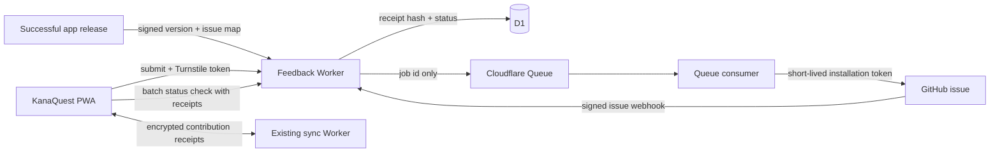

# Feedback-to-fix implementation plan

**Status:** proposal, researched 2026-08-24
**Scope:** in-app feedback submission, GitHub issue creation, request tracking,
release-aware notifications, and a learner-facing contribution history

## Recommendation and difficulty

The button itself is easy. A form can call a Worker, and the Worker can create a
GitHub issue with one API request. The surrounding product is a **medium-sized
feature** because a public submission endpoint needs abuse protection, GitHub
credentials must never reach the browser, issue state has to be translated into
friendly in-app state, and "fixed" must be distinguished from "actually present
in the version this learner has loaded."

Rough one-developer estimates:

| Result | Focused time | What it includes |
| --- | ---: | --- |
| Safe feedback-to-GitHub MVP | 2–4 days | Form, separate Worker, Turnstile, D1 receipt, queued GitHub issue creation, basic tests |
| Tracked feedback loop | +4–7 days | Synced receipt history, GitHub webhooks, status screen, release mapping, one-time notification |
| Polished recognition experience | +2–4 days | Contribution garden/graphics, accessibility and copy polish, failure and offline states |
| Full first release | About 8–15 days | All of the above, staging, operational safeguards, documentation, and deployment automation |

The recommended shape is:

1. Keep `kana-quest-sync` exactly what it is: an opaque encrypted-document
   service that cannot inspect learner profiles.
2. Add a separate `kana-quest-feedback` Worker. It owns the GitHub secret, a D1
   database, a Queue, Turnstile validation, and webhook handling.
3. Give each submission an unguessable receipt. Store the clear receipt only in
   the learner's encrypted KanaQuest profile; store only its hash on the feedback
   server.
4. Call the learner-facing screen **My contributions**, not Account. It feels
   personal and follows the learner across synced devices without introducing
   email, passwords, or a server-readable identity.
5. Treat an issue as "released" only when release metadata names both the exact
   `APP_VERSION` and the feedback issue. Closing an issue or merging a pull
   request is not enough.

For a child-facing production app, raw reports should go to a **private GitHub
feedback-inbox repository** by default. If the existing repository is used and
is public, the form must plainly say the report will be public and must ask the
learner not to include their name, school, email, or other personal details.
There is no reliable automatic scrubber for all personal information.

## Goals

- A persistent Feedback action that is easy to reach without interrupting study.
- A bug, idea, content correction, or other report becomes a structured GitHub
  issue without exposing a GitHub credential in the PWA.
- A temporary GitHub or network failure does not lose the report or create
  duplicates.
- The submitting learner can see all of their reports, their current status, and
  a grateful acknowledgement of how they helped.
- The history follows the learner via the existing end-to-end encrypted sync.
- The first eligible load of the released app celebrates implemented feedback
  once, then remembers that acknowledgement across devices.
- The service stores no learner name, study progress, sync code, or stable
  account identifier.
- The maintenance path from issue to triage to pull request to release is as
  automatic as it can safely be.

## Non-goals for the first release

- A conventional login, password, email address, or GitHub account for learners.
- Email or push notifications while KanaQuest is closed.
- A public leaderboard or competitive reward system.
- Mirroring arbitrary GitHub comments into the child-facing app.
- Letting public issue text directly trigger an AI coding agent, merge, or
  deployment.
- Guaranteeing exactly one celebration across two devices that remain offline
  and open the new version simultaneously. Synced acknowledgement makes this
  effectively once per learner in normal use; that rare offline race may show it
  once on each device.
- Account-style recovery after the learner loses every local copy, backup, and
  sync code. With no identity service, losing every clear receipt also loses the
  ability to reconstruct that learner's contribution list.

## Why this fits the current codebase

KanaQuest is a static, no-build PWA backed by IndexedDB. A learner profile is
saved as one document in `src/store.js`, and `src/merge.js` explicitly rebuilds
the fields that survive a cross-device merge. The sync Worker in
`sync-server/` deliberately accepts only opaque ciphertext, uses a capability
derived from the sync code, and allows broad CORS because possession of that
capability is already its authorization boundary.

Those choices should remain intact:

- Feedback receipts belong in the encrypted profile document, so they already
  benefit from backup, import, and cross-device sync.
- Queryable operational state does **not** belong in the sync Durable Object.
  GitHub webhooks need to find a request by issue number, and release jobs need
  to find requests by released version. That is a D1 job.
- GitHub private keys, webhook secrets, and Turnstile secrets belong only in the
  feedback Worker as Cloudflare secrets.
- `mergeProfiles()` must gain explicit contribution merge rules. Simply adding a
  property in `createProfile()` would otherwise leave conflict behavior
  undefined and could lose acknowledgements.
- `APP_VERSION` in `src/app.js`, the service-worker version in `sw.js`, and the
  user-facing changelog already form the beginning of a release identity. The
  notification flow should extend that convention, not invent a separate build
  number.

## Proposed architecture



Use a separate `feedback-server/` project rather than adding these routes and
secrets to `sync-server/`. The services have different trust models:

| Existing sync Worker | New feedback Worker |
| --- | --- |
| Cannot read its payload | Validates and formats user text |
| Opaque capability is authorization | Turnstile, receipt capabilities, webhook HMAC, and admin HMAC |
| Broad CORS is deliberate | Production origin allowlist plus real server-side controls |
| Durable Object stores one encrypted blob | D1 supports issue, status, event, and release queries |
| No third-party credentials | Holds a narrowly scoped GitHub App private key |

Separation limits the blast radius of a feedback bug or leaked GitHub key and
keeps the privacy promise of sync easy to explain and audit.

## End-to-end lifecycle

### 1. Submit

1. The learner opens Feedback from the app header or Settings.
2. They choose **Bug**, **Idea**, **Content correction**, or **Something else**,
   enter a short title and details, and review a clear privacy/publication note.
3. The client generates:
   - `feedbackId`: `crypto.randomUUID()`, also the idempotency key.
   - `receiptToken`: 32 random bytes encoded as base64url.
4. The client stores a local `sending` contribution before making the request.
   It may temporarily include the unsent details, which are cleared as soon as
   the server accepts them. This makes retry after a tab close or network loss
   possible without retaining every report body forever.
5. Turnstile runs only when the learner submits. The PWA sends the form, a small
   allowlisted diagnostic object, `feedbackId`, `receiptToken`, and the fresh
   Turnstile token to `POST /v1/feedback`.
6. The Worker validates the origin, body shape and size, Turnstile hostname and
   action, rate limits, and allowed diagnostic fields. It hashes the receipt
   token with a server-side pepper and inserts the D1 row.
7. The Worker attempts to enqueue the `feedbackId` and returns `202 Accepted`
   immediately. The D1 row is the durable source of truth: an `enqueuedAt`
   marker, idempotent retries, and a scheduled sweep recover a row if D1 commits
   but Queue delivery fails. The client keeps the clear receipt in the encrypted
   profile and shows **Received — preparing the GitHub issue**.

The client-generated ID and receipt make retry safe. Before spending a new
Turnstile token, check for an existing syntactically valid ID: if its receipt
hash matches, ensure an unqueued row is enqueued and return the existing record.
The same ID with a different receipt is `409 Conflict`. This also handles a
successful first request whose response was lost after Turnstile's single-use
token was redeemed.

### 2. Create the GitHub issue

1. A Queue consumer loads the pending payload from D1. The Queue message itself
   contains only the ID, so user text is not exposed in Queue inspection tools.
2. The consumer authenticates as the repository installation of a GitHub App.
   It signs a short JWT with the app private key, exchanges that JWT for a
   one-hour installation token, and calls `POST /repos/{owner}/{repo}/issues`.
3. The issue title, labels, repository, and template are server controlled. User
   text can fill only the clearly delimited feedback section.
4. Before calling GitHub, the consumer moves the row to `creating`. A hidden
   marker such as `<!-- kanaquest-feedback:<uuid> -->` is included in the issue
   body. If a retry finds `creating` with no saved issue number, it first lists
   recent server-labelled issues and inspects their markers. It does not blindly
   create again. This recovers the mapping if GitHub creates the issue but the
   Worker fails before saving the issue number.
5. The consumer saves the issue number and the `submitted` event, clears the
   pending detail payload from D1, and acknowledges the message.

Queue delivery is at-least-once and GitHub's create-issue endpoint has no
application idempotency key, so the consumer must check D1 before every external
side effect. Retry `429` and `5xx` failures with backoff. Treat validation and
permission errors as permanent, set `delivery_failed`, and send the job to a
dead-letter queue or an equivalent operator-visible failure path after the retry
limit. Never blindly create a second issue.

### 3. Track triage and implementation

The GitHub App subscribes to the `issues` webhook. The Worker verifies
`X-Hub-Signature-256` against the raw request body and deduplicates delivery IDs
before processing. GitHub state is translated into a small, curated state
machine:

| App status | Typical GitHub signal | Learner-facing copy/graphic |
| --- | --- | --- |
| `sending` | D1 row exists; issue job pending | Seed: “Sending your feedback…” |
| `submitted` | Issue created | Seed: “Thank you — it reached the team.” |
| `under_review` | Default after submission or `status:reviewing` | Watering can: “It is being looked at.” |
| `planned` | `status:planned` label | Sprout: “This is planned.” |
| `in_progress` | `status:in-progress` label | Growing plant: “Work has started.” |
| `fixed` | Issue closed as completed or linked PR merged | Bud: “Fixed, waiting for an app update.” |
| `released` | Successful release explicitly maps this issue to a version | Flower/star: “Your feedback improved this version!” |
| `duplicate` | Maintainer maps it to a canonical request | Joined seeds: “Others asked too — your report still helped.” |
| `not_planned` | Closed as not planned or `status:not-planned` | Thank-you card without a progress promise |
| `delivery_failed` | Permanent GitHub/API failure | “Saved, but could not reach the team yet”; retry/support action |

Only labels, issue close reasons, explicit duplicate mappings, and release data
become app status. Do not display issue comments automatically: comments can
contain maintainer shorthand, personal information, hostile content, or promises
that were not intended as product copy.

For duplicate reports, keep the original learner's contribution. Record a
`canonicalIssueNumber`; when the canonical request is released, fan the released
status out to every linked report so each contributor receives credit.

### 4. Mark a fix as released

An issue being closed means “the code work is done,” not “this browser is running
the fix.” Add exact release metadata to the existing changelog convention. A
backward-compatible target shape is:

```js
{
  version: '2026-08-25a',
  date: '2026-08-25',
  changes: [
    {
      text: 'Fixed the placement-test result display.',
      feedback: [{ issue: 123, message: 'Your report helped fix the result display.' }],
    },
  ],
}
```

Older changelog entries may remain strings and omit `version`. New releases that
credit feedback include the exact `APP_VERSION`; one date may therefore have
more than one release entry when needed.

The release path should eventually be:

1. A pull request uses `Fixes #123` when the issue is in the same repository, or
   `Fixes owner/kana-quest-feedback#123` for a private inbox in another
   repository. GitHub supports both forms and closes the linked issue when the
   pull request is merged into the default branch.
2. Merge/close webhooks move the request to `fixed`, never directly to
   `released`.
3. A GitHub Pages release workflow verifies that `src/app.js`, `sw.js`, and the
   newest exact changelog version agree, runs tests, and deploys the site.
4. Only after deployment succeeds, the workflow sends the version, credited
   issue numbers, and friendly messages to `POST /v1/admin/releases`, signed
   with a dedicated HMAC secret held in both GitHub Actions secrets and the
   Worker.
5. The Worker validates the signature and idempotency key, records the release,
   updates matching feedback rows, and expands canonical/duplicate mappings.

A manual release command can be the Phase 4 bridge if replacing the current
GitHub Pages branch deployment is too much at once. The payload and validation
should be identical so automation later does not require a data migration.

### 5. Notify on the first eligible load

After a learner profile opens, and no more than once per reasonable freshness
window, the app batch-fetches status for its active receipt tokens. It saves newer
server events into the profile, then checks each unacknowledged release:

```text
releasedIn exists
AND loaded APP_VERSION >= releasedIn
AND acknowledgedVersion < releasedIn
```

Comparison must parse the repository's `YYYY-MM-DD` plus optional letter suffix
rather than relying on an undocumented string trick. Most importantly, use the
`APP_VERSION` from the JavaScript that is actually executing. A deployment event
alone must never make an old service-worker-controlled client claim it has a fix.

If one or more contributions are eligible, show one combined celebration after
the home screen is stable:

> 🌸 You helped improve KanaQuest
>
> Your report about placement-test results was fixed in this update. Thank you!

On dismissal, save `acknowledgedVersion` and `acknowledgedAt`; the ordinary
profile save marks sync dirty. Merge acknowledgement timestamps by maximum so a
celebration acknowledged on one synced device is normally suppressed on the
other. If status refresh fails offline, cached `released` state may still trigger
once the current version is eligible.

## Client data model and merge behavior

Add a map keyed by `feedbackId` to each profile. Names below are illustrative;
the implementation should settle them in one exported normalizer.

```js
contributions: {
  '<uuid>': {
    receiptToken: '<base64url capability>',
    category: 'bug',
    title: 'Placement result looks wrong',
    pendingDetails: null, // present only until the server accepts an offline draft
    createdAt: 1787590000000,
    status: 'submitted',
    statusUpdatedAt: 1787590005000,
    issueNumber: 123,
    issueUrl: null, // exposed only when the learner is allowed to open it
    canonicalIssueNumber: null,
    releasedIn: null,
    releaseMessage: null,
    acknowledgedVersion: null,
    acknowledgedAt: null,
    localUpdatedAt: 1787590005000,
  },
},
forgottenContributions: {
  '<uuid>': 1789000000000,
},
```

Rules:

- New profiles start with empty maps; older profiles normalize missing maps to
  empty maps without requiring an IndexedDB schema bump.
- A contribution present on only one side is copied.
- For the same ID, server-owned status fields use the record with the newest
  `statusUpdatedAt`; acknowledgement and local edit timestamps use the maximum.
- A tombstone in `forgottenContributions` beats any older contribution record.
  This prevents an old device from resurrecting an item the learner removed.
- The receipt token is a capability and must never be logged, put in a URL,
  included in GitHub, or sent anywhere except the feedback status API over HTTPS
  and the existing encrypted profile sync.
- “Remove from My contributions” removes the local receipt after writing a
  tombstone. It does not delete an already-created GitHub issue; explain that
  before confirming.
- Keep only the title/category locally for history. Do not retain the full report
  body after submission. An offline/unsent record may keep `pendingDetails`
  temporarily so retry survives closing the app, but acceptance clears it.
- Return/show the GitHub URL only for a public issue or a viewer who can access
  it. A private inbox still shows the complete friendly timeline in the app.

This field is part of the encrypted profile and therefore also appears in
plaintext backup exports. That is another reason to minimize it and never put a
contact address or real-world identity there by default.

## Server data model

Use D1 migrations in `feedback-server/migrations/`. A compact first schema needs
four concepts:

### `feedback_requests`

- `id TEXT PRIMARY KEY` — client UUID/idempotency key.
- `receipt_hash TEXT NOT NULL` — HMAC-SHA-256 of the random receipt using a
  Worker secret pepper, plus `receipt_hash_version` so the pepper can rotate.
- `category TEXT NOT NULL` with a check constraint.
- `pending_payload TEXT` — validated title/details/diagnostics, retained only
  until GitHub creation succeeds (or temporarily for operator recovery).
- `enqueued_at INTEGER`, `create_started_at INTEGER` — outbox/reconciliation
  markers for the D1-to-Queue and Queue-to-GitHub failure windows.
- `github_issue_number INTEGER UNIQUE`.
- `status TEXT NOT NULL`, `status_updated_at INTEGER NOT NULL`.
- `canonical_issue_number INTEGER` for duplicates.
- `released_version TEXT`, `release_message TEXT`, `released_at INTEGER`.
- `created_at INTEGER`, `updated_at INTEGER`.

### `feedback_events`

An append-only, learner-safe timeline: feedback ID, event type, friendly message,
source (`submission`, `github`, `release`, or `operator`), source event ID, and
timestamp. Unique source IDs make webhook/release retry idempotent.

### `webhook_deliveries`

GitHub delivery ID as the primary key plus received/processed timestamps and a
short outcome. Retain for a bounded period, such as 30 days, to reject replay
without building an indefinite event log.

### `releases`

Version as the primary key, deployment timestamp, source commit, and a hash of
the credited issue mapping. Replaying the same mapping succeeds; changing an
already-recorded version is rejected and requires an explicit operator action.

Index issue number, status, and released version. Use D1 prepared statements for
all values and a transaction/batch for a status change plus its event. If data
locality is important, choose D1's EU jurisdiction **when creating the database**;
it cannot be added to that database afterward.

## API surface

All responses use stable machine codes plus friendly client copy. Do not return
raw GitHub or database errors.

### `POST /v1/feedback`

Accepts the validated fields described in the submit lifecycle. Bounds should be
small and explicit, for example: title 10–100 characters, details 10–4,000,
category from a fixed enum, diagnostics from a fixed property allowlist, and a
total body cap around 8–16 KB. Return `202` with the ID and current status.

### `POST /v1/feedback/status`

Accepts at most 50 `{ id, receiptToken }` pairs. POST keeps capabilities out of
URLs, browser history, CDN logs, and referrers. For each valid receipt, return the
current safe state and timeline events newer than the client's cursor. Invalid
receipts are omitted or returned as an indistinguishable `not_found` result so
the endpoint cannot enumerate reports.

### `POST /v1/github/webhook`

Reads the raw bytes once, verifies the GitHub HMAC in constant time, checks the
repository and installation IDs against fixed configuration, deduplicates the
delivery, and handles only subscribed event/action combinations. Return quickly;
queue unusually heavy reconciliation work.

### `POST /v1/admin/releases`

Accepts only a signed, timestamped, idempotent release payload. Reject stale
timestamps, unknown issue numbers, invalid version syntax, mismatched repository,
and replay with changed content. This endpoint is for release automation, not
the browser.

### Optional `POST /v1/feedback/retry`

Usually unnecessary because the Queue retries itself. It may be useful later for
a learner to re-enqueue a known `delivery_failed` record with a valid receipt,
subject to tighter limits.

## GitHub setup and issue format

Create a private GitHub App owned by the repository owner and install it on only
the feedback repository. Grant the minimum repository permissions:

- **Issues: read and write** — create issues and receive issue lifecycle events.
- **Metadata: read** — repository identity/metadata.
- Subscribe only to the **Issues** webhook initially.

Store the app ID, installation ID, private key, webhook secret, receipt-hash
pepper, Turnstile secret, and release HMAC secret as Worker secrets. Keep the
Turnstile site key and non-sensitive repository coordinates as configuration.
Never commit `.dev.vars` or private keys. Use a current Worker compatibility date;
the current runtime supports `node:crypto`, which can sign the GitHub JWT from
the PKCS#1 key GitHub supplies without putting key conversion logic in the
browser or repository.

Server-controlled GitHub labels might be:

- `from:kanaquest-app`
- `kind:bug`, `kind:idea`, `kind:content`, `kind:other`
- `status:reviewing`, `status:planned`, `status:in-progress`

Example body:

```md
## In-app feedback

**Kind:** Bug

### What happened / idea

<sanitized user text>

### App context

- Version: 2026-08-24e
- Screen: placement-result
- Install mode: standalone
- Browser family: Safari

_Submitted from KanaQuest. No learner name, progress, sync code, or contact
details were attached._

<!-- kanaquest-feedback:4c743f78-... -->
```

Neutralize `@mentions` and other accidental notification syntax in user text,
bound Markdown/HTML, and prepend a fixed title prefix. The browser never chooses
labels, assignees, repository, milestone, project, or issue state.

A fine-grained personal access token restricted to one repository with Issues
write access is acceptable for a very short private prototype, but the GitHub
App is the release design: installation tokens expire after one hour, actions
are attributed to the app, and permissions/installations are narrower than a
maintainer-owned long-lived token.

## Feedback form UX

### Entry points

- A quiet speech-bubble **Feedback** icon in the persistent app header, with an
  accessible label and at least the existing minimum touch target.
- A full-width **Feedback and ideas** row in Settings for discoverability and as
  a fallback if the header becomes crowded.
- A **My contributions** row in Settings or on the learner home/profile screen.

Do not show the feedback action inside answer controls where it could be tapped
by accident. If opened during a quiz, include the screen/session context but do
not discard or mutate the session.

### Form

- Four large category choices with examples.
- Short title and a details field with a visible character count.
- “Include app details to help diagnose this” enabled by default, followed by an
  exact expandable list of what will be sent.
- If the destination is public, an unavoidable notice immediately above Submit:
  “This report will be public on GitHub. Do not include your name, school, email,
  or anything private.”
- Optional **Public credit name** only behind a parent/adult-facing disclosure,
  off by default, and separate from the learner profile name. The safest first
  release omits this entirely.
- Turnstile with managed/interaction-only appearance and accessible error,
  expired, and unsupported-browser states.
- Success closes to a receipt card, not an empty form.

Allowlisted diagnostics may include:

- `APP_VERSION` and service-worker version.
- Current route/screen and course/mode identifiers from a fixed enum.
- Installed/standalone versus browser mode.
- Broad browser family and platform family.
- Viewport class (`small`, `medium`, `large`), online state, and locale.

Do **not** include learner/profile name, emoji, progress, answers, study list,
sync code/document ID, receipt tokens, full URL/query string, clipboard data,
free-form logs, or a full user-agent/stack trace without a separate explicit
choice and review.

### Offline behavior

Save a local draft/pending record and say **Saved — will send when online**.
Retry on the next online event or app load using the same ID and receipt. The
fresh Turnstile token must be acquired at actual send time because tokens expire
and are single-use; therefore a background retry may need the learner to reopen
the saved draft and tap Send. Do not promise fully silent offline delivery in
Phase 1.

## My contributions and recognition UX

This is a profile-level screen, not a server account. Its data comes from the
encrypted profile plus receipt-authenticated status refreshes.

Suggested layout:

1. A header using the learner's existing emoji and accent color:
   **“You help KanaQuest grow.”**
2. Small non-competitive totals: **Ideas shared**, **Being worked on**, and
   **Improvements shipped**.
3. An **improvement garden**: each submitted report is a seed, planned work a
   sprout, in-progress work a plant, and released work a flower/star. Use inline
   SVG/CSS and honor `prefers-reduced-motion`.
4. Cards sorted by latest update, with category, title, date, friendly status,
   timeline, and GitHub link when appropriate.
5. A shipped card says exactly what changed and in which version. It credits the
   learner locally using their profile identity; it does not publish that name.
6. Controls to hide/forget a receipt and refresh status.

Avoid points, rankings, streak pressure, or implying that every idea will be
built. Gratitude should remain true in `not_planned` and duplicate states:
reporting, clarifying, and confirming demand are all useful contributions.

## Security, privacy, and abuse controls

Layer the controls; none is sufficient alone:

- **Private-by-default issue inbox:** especially important if learners may be
  children. Maintainers can later promote a sanitized accepted item to the
  public repository.
- **Turnstile server validation:** verify success, expected hostname, expected
  `action`, and token freshness. Tokens are valid for five minutes and can be
  redeemed only once.
- **Rate limits:** use the Workers Rate Limiting binding for short bursts keyed
  primarily by a random local installation ID/route, plus a coarse IP/global
  backstop and a D1 daily circuit breaker. Do not retain raw IP addresses.
  Cloudflare warns that IP-only limits can penalize shared networks, so they
  should not be the sole user key.
- **Fixed input schema and body cap:** reject unknown categories, unexpected
  diagnostic keys, non-string text, extreme nesting, and oversized requests.
- **Untrusted Markdown handling:** neutralize mentions and control the template.
  Never turn user fields into labels, assignees, repository paths, commands, or
  workflow expressions.
- **Capability receipts:** random 256-bit tokens, HMAC-hashed at rest, compared
  in constant time, batched only in POST bodies, and revocable locally by
  forgetting them.
- **Webhook verification and replay defense:** HMAC over the raw body, expected
  installation/repository, delivery-ID uniqueness, event/action allowlist.
- **Least-privilege GitHub App:** one repository, Issues only, secret rotation.
- **Separate production and staging:** different Worker, D1, Queue, Turnstile
  widget, GitHub test repository/installation, and secrets.
- **Safe logs:** request IDs, state transitions, latency and error class only;
  never report body, receipt, Turnstile token, GitHub token, or profile data.
- **Data retention:** erase D1 `pending_payload` after issue creation; delete
  failed payloads after a documented recovery period. Keep only receipt hash,
  issue/status mapping, safe messages, and timestamps needed for contribution
  history.
- **No autonomous code execution from feedback:** automation may create and
  label an issue, add it to a project, or produce a maintainer-visible triage
  suggestion. A trusted maintainer still decides whether code is generated,
  reviewed, merged, and released.

Before launch, add a short privacy paragraph in the app explaining that a report
is sent to Cloudflare and stored as a GitHub issue, whether that issue is private
or public, what diagnostics are attached, and how long the routing metadata is
kept.

## Implementation phases

### Phase 0 — Decisions and service skeleton (0.5–1 day)

- [ ] Choose the destination: private `kana-quest-feedback` inbox
  (**recommended**) or the existing repository with a public-submission warning.
- [ ] Register a private GitHub App, install it on only the chosen repository,
  configure Issues read/write + Metadata read, and subscribe to Issues events.
- [ ] Create `feedback-server/` with current Wrangler, module Worker entry point,
  generated binding types, production/staging environments, and test harness.
- [ ] Create an EU-jurisdiction D1 database if that locality is desired; this is
  a creation-time choice.
- [ ] Create main Queue and dead-letter Queue, a Turnstile widget per environment,
  and a Workers Rate Limiting binding.
- [ ] Store all secrets through Wrangler/Cloudflare, document their names and
  rotation procedure, and ensure local secret files are ignored.
- [ ] Record final public status names, GitHub labels, body limits, retention,
  and allowed origins in a short server README.

**Exit:** a deployed staging Worker has `/health`, empty D1 migrations applied,
bindings present, and no GitHub credential in source or client assets.

### Phase 1 — Safe feedback-to-GitHub MVP (1.5–3 days)

- [ ] Add the feedback entry points and accessible modal/form.
- [ ] Implement explicit Turnstile rendering and reset/expiry handling.
- [ ] Add `src/feedback.js` for draft validation, secure ID/receipt generation,
  submission, retry, and stable error mapping.
- [ ] Add D1 request/event migrations and prepared-statement repository helpers.
- [ ] Implement `POST /v1/feedback` validation, HMAC receipt hashing,
  idempotent insert, rate limits, and queue send.
- [ ] Implement GitHub App JWT/installation-token caching and issue creation in
  the Queue consumer, with per-message try/catch, explicit ack/retry, backoff,
  and dead-letter handling.
- [ ] Add the hidden marker and a narrow reconciliation command for the rare
  GitHub-created/D1-not-updated failure window.
- [ ] Add a scheduled outbox sweep that re-enqueues accepted D1 rows whose
  initial Queue send did not complete.
- [ ] Add staging integration tests against a dedicated GitHub test repository;
  production tests should mock GitHub by default and never litter the real issue
  tracker.

**Exit:** a submission returns a receipt immediately, creates exactly one
structured GitHub issue despite request/queue retries, and exposes no secret or
profile data.

### Phase 2 — Synced receipts and My contributions (1.5–3 days)

- [ ] Add `contributions` and `forgottenContributions` to new/normalized
  profiles.
- [ ] Extend `mergeProfiles()` with the timestamp and tombstone rules above.
- [ ] Extend backup validation/normalization without breaking old backups.
- [ ] Implement the authenticated batch status endpoint and client refresh with
  bounded cadence/backoff.
- [ ] Build the My contributions screen with honest pending/failure/empty/offline
  states, issue links, refresh, and forget controls.
- [ ] Save newer status snapshots through the normal profile path so existing
  automatic sync carries them across devices.

**Exit:** a paired device receives the history and receipt capabilities through
encrypted sync, then independently refreshes verified server status. An
unpaired profile retains a local history on that device.

### Phase 3 — GitHub status bridge (1–2 days)

- [ ] Add raw-body webhook signature verification and constant-time comparison.
- [ ] Add delivery replay protection and strict repository/installation/event
  checks.
- [ ] Translate issue labels, close reasons, reopen actions, and canonical
  duplicate mappings into the curated event model.
- [ ] Add simple maintainer documentation: which labels move which app states,
  what does not notify, and how to correct a mistaken state.
- [ ] Add reconciliation for webhook downtime by polling only known mapped
  issues from an operator-triggered job, not on every user request.

**Exit:** maintainer changes in GitHub appear in My contributions, while
arbitrary comments and unknown labels never appear in the app.

### Phase 4 — Release-aware thank-you notification (2–3 days)

- [ ] Extend changelog entries with exact version and feedback-credit metadata,
  preserving legacy string entries.
- [ ] Add a test that `APP_VERSION`, `sw.js`, and exact release metadata agree.
- [ ] Implement the signed, idempotent release endpoint and duplicate fan-out.
- [ ] Start with a manual release command if needed, then make a successful Pages
  deployment call the same endpoint automatically.
- [ ] Implement version parsing, eligible-release selection, combined
  celebration, acknowledgement persistence, and acknowledgement merge tests.
- [ ] Ensure the notification waits until the new version's JavaScript is
  actually loaded and never blocks app startup or study.

**Exit:** closing or merging does not celebrate; a successful mapped deployment
does, on the first eligible learner load, and acknowledgement normally follows
the learner across devices.

### Phase 5 — Recognition polish (2–4 days)

- [ ] Build the improvement-garden graphic and status card visuals using the
  profile accent and emoji.
- [ ] Add reduced-motion, screen-reader, keyboard, small-screen, dark-theme, and
  high-contrast checks.
- [ ] Polish copy for duplicate, not-planned, failed, and multiple-fixes-at-once
  cases so gratitude never overpromises.
- [ ] Add optional local milestones such as “first report” and “first shipped
  improvement”; keep them private, non-competitive, and non-streak-based.
- [ ] User-test whether Feedback belongs permanently in the header or is better
  as a home/Settings action once discoverability has been established.

**Exit:** recognition feels celebratory but remains calm, accessible, private,
and truthful for requests that are not implemented.

### Phase 6 — Further automation (optional)

- Automatically add `from:kanaquest-app` issues to a GitHub Project using a
  maintainer-owned workflow, not extra permissions in the browser-facing app.
- Produce a private AI triage suggestion for duplicate detection, component, and
  severity. A maintainer approves it before labels or public text change.
- Generate a draft changelog/credit entry from merged PR links, but require the
  release commit to include and review the final learner-facing message.
- Add optional adult contact notifications only after a separate consent,
  verification, retention, and unsubscribe design. They are not required for the
  in-app loop.

## Test plan

### Pure/client tests

- Contribution merge is commutative and idempotent for status timestamps,
  acknowledgement timestamps, and forget tombstones.
- Old profiles/backups with no contribution fields continue to open and import.
- Two pending retries reuse one ID and receipt.
- Status refresh accepts only newer server events and never downgrades
  `released` because of stale cached data.
- Version comparison covers same day letters, later dates, equal versions,
  malformed server versions, and an app older than the fix.
- One contribution, several contributions in one release, and several releases
  awaiting acknowledgement produce one coherent celebration.
- Acknowledgement survives save, backup/import, and sync merge.
- Feedback route context is allowlisted and opening/closing the modal does not
  disturb an active quiz.

### Worker tests

- Body limits, Unicode, missing/extra keys, category enum, and Markdown mention
  neutralization.
- Turnstile success, failure, wrong hostname/action, expiry, duplicate token,
  and service failure.
- Receipt format, HMAC storage, constant-time comparison, invalid receipt, mixed
  valid/invalid status batch, and maximum batch size.
- Rate-limit and global circuit-breaker responses.
- D1 idempotent insert: same ID/same receipt succeeds; same ID/different receipt
  conflicts.
- GitHub `201`, `401`, `403`, `404`, `410`, `422`, `429`, `5xx`, timeout, and
  malformed response handling.
- Queue duplicate delivery, one-message failure inside a batch, retry backoff,
  permanent failure, and dead-letter path.
- Crash after GitHub issue creation but before D1 mapping, followed by marker
  reconciliation without a duplicate issue.
- Webhook valid/invalid signature, Unicode raw body, replayed delivery, wrong
  repository/installation, known/unknown actions, reopen, labels, close reason,
  and duplicate mapping.
- Release signature, stale request, replay, changed replay, unknown issue,
  duplicate fan-out, and transaction rollback.

### Integration and manual checks

- Local Worker + local D1 + mocked GitHub and Turnstile.
- Staging Worker + production-like Turnstile test keys + dedicated GitHub test
  repository.
- Real phone/iPad PWA: submission, offline draft, service-worker update, theme,
  keyboard, rotation, reduced motion, and screen reader.
- Two paired devices: submit on A, view on B, release on server, celebrate and
  acknowledge on B, sync, confirm A does not celebrate again.
- Verify request/Worker/Queue logs never contain body text, receipt tokens,
  profile data, or GitHub credentials.

## Operations and maintenance

- Add Workers logs/metrics for accepted, queued, created, rate-limited,
  Turnstile-rejected, webhook-rejected, released, retried, and dead-lettered
  counts. Use IDs only where needed for debugging.
- Alert on dead-letter messages, sustained GitHub auth errors, webhook signature
  failures, and a growing `sending` backlog.
- Document private-key, webhook-secret, Turnstile-secret, receipt-pepper, and
  release-secret rotation. Rotating the receipt pepper requires a versioned hash
  strategy or retaining the old pepper until all records are migrated.
- Back up/export D1 schema and minimal routing metadata; GitHub remains the
  canonical report body after successful creation.
- Add a scheduled cleanup for webhook-delivery dedupe rows and expired failed
  payloads. Do not automatically delete active feedback history.
- Keep staging and production issue labels/configuration in a checked-in setup
  document or script so status mappings cannot silently drift.
- Add a kill switch that stops new submissions while leaving status reads and
  encrypted profile sync available.

## Likely file changes

New files/directories:

- `feedback-server/` — Worker, Wrangler config, D1 migrations, Queue consumer,
  GitHub client, webhook/release verification, and tests.
- `src/feedback.js` — client submission, receipt/status transport, offline draft.
- `src/contributions.js` — pure contribution normalization, merge, version and
  notification eligibility helpers.
- Worker/release setup documentation and a staging smoke-test command.

Existing files likely touched:

- `index.html` — feedback modal, entry points, My contributions screen.
- `styles.css` — form, cards, garden, celebration and accessible states.
- `src/app.js` — routing/rendering, boot-time refresh/notification, event wiring,
  exact `APP_VERSION` release integration.
- `src/store.js` — new-profile defaults and backup validation/normalization.
- `src/merge.js` — explicit contribution/tombstone merge.
- `src/changelog.js` — optional exact version and feedback-credit metadata.
- `sw.js` — cache list/version when client modules are added.
- `test/store.js`, `test/sync.js`, `test/wiring.js`, and service-worker tests.
- `README.md` — architecture, local feedback-server setup, tests, privacy, and
  release procedure.

## Phase-0 choices to confirm

The plan has recommendations, but these are product decisions rather than
implementation trivia:

1. **Issue visibility:** private feedback inbox (recommended for child safety) or
   public issues with explicit disclosure.
2. **Public attribution:** omit in v1 (recommended) or allow a separately entered,
   explicitly public alias with adult-facing consent text.
3. **Header placement:** always-visible Feedback action (recommended for the
   initial learning period) or Settings/home only.
4. **Release automation:** manual signed command first, then Pages workflow
   (lower migration risk), or replace the Pages deployment path during Phase 4.

None of these choices requires a conventional user account. The receipt model
supports the requested remembered history and release notification while keeping
the existing no-account, encrypted-sync design.

## Research references

GitHub's official documentation confirms that issue creation accepts GitHub App
installation tokens and requires Issues write permission, and warns that rapid
content creation can trigger secondary rate limiting:
[Create an issue](https://docs.github.com/en/rest/issues/issues#create-an-issue).
Installation tokens are obtained with an app JWT and expire after one hour:
[Generating an installation access token](https://docs.github.com/en/apps/creating-github-apps/authenticating-with-a-github-app/generating-an-installation-access-token-for-a-github-app).
Webhook signatures must be verified from `X-Hub-Signature-256`:
[Validating webhook deliveries](https://docs.github.com/en/webhooks/using-webhooks/validating-webhook-deliveries).
GitHub recommends choosing the minimum GitHub App permissions:
[Choosing permissions for a GitHub App](https://docs.github.com/en/apps/creating-github-apps/registering-a-github-app/choosing-permissions-for-a-github-app).
Closing keywords can link a pull request to an issue in another repository with
the full `owner/repository#number` syntax:
[Linking a pull request to an issue](https://docs.github.com/en/issues/tracking-your-work-with-issues/using-issues/linking-a-pull-request-to-an-issue).

Cloudflare documents that Queue delivery is at-least-once and recommends unique
IDs/idempotency for side effects:
[Queues delivery guarantees](https://developers.cloudflare.com/queues/reference/delivery-guarantees/).
Turnstile requires server-side Siteverify validation; tokens expire after five
minutes and are single-use:
[Validate the token](https://developers.cloudflare.com/turnstile/get-started/server-side-validation/).
D1 supports versioned migrations and bound prepared statements:
[D1 migrations](https://developers.cloudflare.com/d1/reference/migrations/) and
[prepared statements](https://developers.cloudflare.com/d1/worker-api/prepared-statements/).
Worker secrets are encrypted bindings rather than source/config values:
[Workers secrets](https://developers.cloudflare.com/workers/configuration/secrets/).
The Workers Rate Limiting binding is fast but permissive/eventually consistent,
and Cloudflare cautions against relying only on shared IP addresses:
[Workers Rate Limiting](https://developers.cloudflare.com/workers/runtime-apis/bindings/rate-limit/).
D1 jurisdiction must be selected when the database is created:
[D1 data location](https://developers.cloudflare.com/d1/configuration/data-location/).
